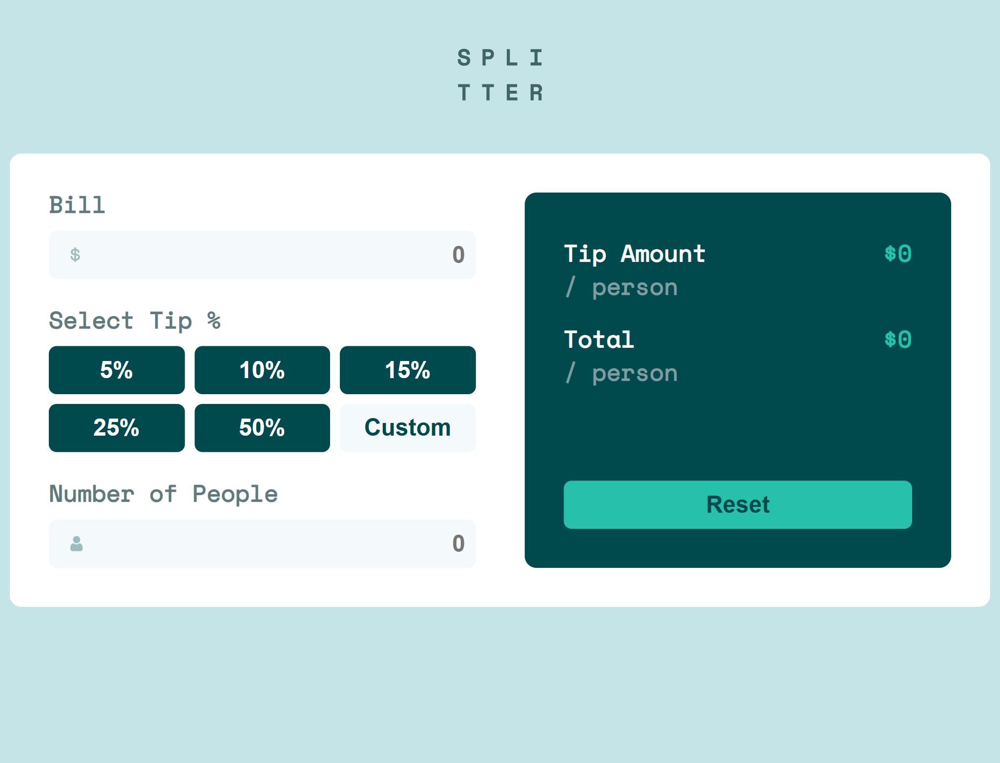

# Frontend Mentor - Tip calculator app solution

This is a solution to the [Tip calculator app challenge on Frontend Mentor](https://www.frontendmentor.io/challenges/tip-calculator-app-ugJNGbJUX). Frontend Mentor challenges help you improve your coding skills by building realistic projects.

## Table of contents

- [Overview](#overview)
  - [The challenge](#the-challenge)
  - [Screenshot](#screenshot)
  - [Links](#links)
- [My process](#my-process)
  - [Built with](#built-with)
  - [What I learned](#what-i-learned)
  - [Continued development](#continued-development)
  - [Useful resources](#useful-resources)
- [Author](#author)

## Overview

### The challenge

Users should be able to:

- View the optimal layout for the app depending on their device's screen size
- See hover states for all interactive elements on the page
- Calculate the correct tip and total cost of the bill per person
- Reset the form to its initial state
- Receive real-time validation and tip calculations as they input data

### Screenshot



### Links

- Solution URL: [Add solution URL here]()
- Live Site URL: [Add live site URL here](https://tip-calc-kappa.vercel.app/)

## My process

### Built with

- Semantic HTML5 markup
- CSS custom properties
- Flexbox
- Mobile-first workflow
- [React](https://reactjs.org/)
- [Vite](https://vitejs.dev/) – for fast development setup
- Context API for state management
- Custom utility functions for calculation and validation

### What I learned

- How to use **Context API** effectively for state managment.
- Separate some functions into **`utils/`** makes the code more understandable and clean.
- Useing regex:

  ```js
  /^\d*\.?\d*$/.test(value);
  ```

### Continued development

- Add animations and tips
- Convert to TypeScript for better types managment

### Useful resources

- [MDN - Math.round()](https://developer.mozilla.org/en-US/docs/Web/JavaScript/Reference/Global_Objects/Math/round)
- [React Docs – Context](https://reactjs.org/docs/context.html)
- [Frontend Mentor Discord](https://discord.gg/frontendmentor)

## Author

- Frontend Mentor - [@yourusername](https://www.frontendmentor.io/profile/PavAndrei)
- GitHub - [@yourusername](https://github.com/PavAndrei)
